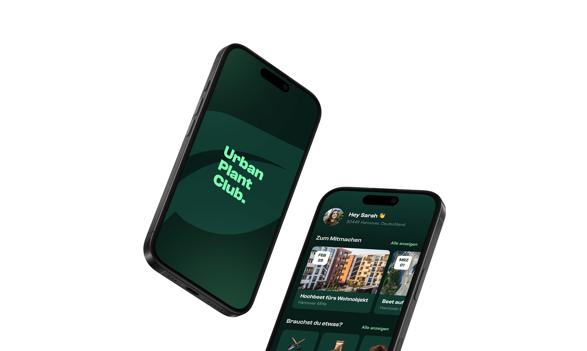
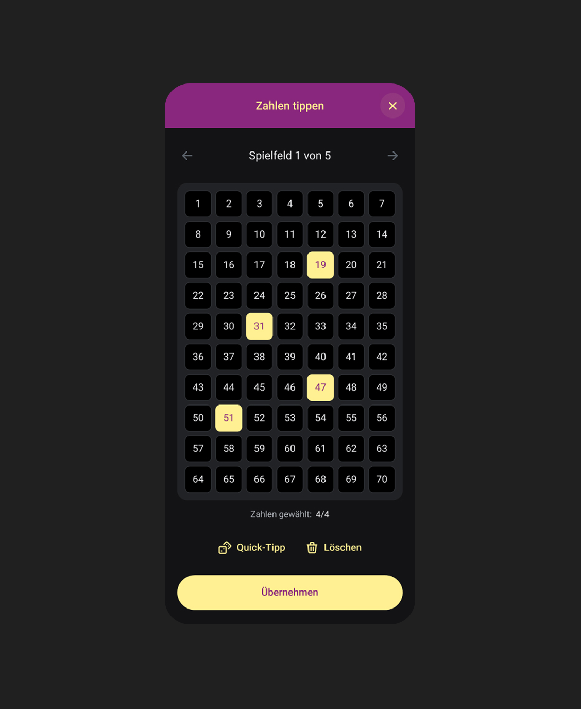

# Portfolio Website – Maik Homeyer

Persönlicher Webauftritt mit Schwerpunkt auf semantischem HTML, Barrierefreiheit und moderner CSS-Architektur. Entstanden im Rahmen des Moduls "Projekt: Web Programmierung" an der IU Internationale Hochschule.

## Über das Projekt

Die Website präsentiert mich als UX Designer und dient als zentrale Plattform für berufliche Bewerbungen. Sie ist als One-Pager mit den vier Sektionen "Über mich", "Projekte", "Werdegang" und "Kontakt" aufgebaut. Eine separate Impressums-Unterseite ergänzt den Webauftritt. Detailansichten der Projekte öffnen sich als Modale über der Startseite, ohne den Kontext zu verlassen.
## Technologie-Stack

- **HTML** als semantische Grundstruktur
- **CSS** mit modernem CSS Nesting für Layout und Gestaltung
- **JavaScript** für Interaktionen, Komponenten-Loading, Theme-Toggle und Scroll-Reveal
- **Git** zur Versionierung des gesamten Quellcodes

### Hinweis zur korrekten Darstellung im Browser

Die Website nutzt JavaScript für das Laden wiederverwendbarer Komponenten (Header & Footer). Sie muss daher über einen lokalen Webserver geöffnet werden – nicht direkt aus dem Dateisystem (`file://`).

## Cases und Portfolio-Inhalt

Die Auswahl der gezeigten Projekte wurde im Laufe der Umsetzung deutlich erweitert und um reale Projekte aus meiner Agenturarbeit ergänzt. Das Portfolio zeigt jetzt eine Mischung aus Studien- und Hochschulprojekten (Urban Plant Club, Overlook Hotel, FleetBase) und beruflichen Projekten für Auftraggeber wie enercity, VHV Versicherungen und Toto-Lotto Niedersachsen. Jeder Case hat eine eigene Detailansicht mit Beschreibung, Tool-Angaben, verlinkten Prototypen und einer Galerie aus Screenshots.

## Konzept und Wireframes

Vor der Implementierung wurde ein umfassendes Konzept erstellt, das das responsive Verhalten, das Gestaltungsraster, die Sitemap, detaillierte Wireframes für Mobile, Tablet und Desktop sowie einen Styleguide zu Typografie, Farben und Komponenten-Patterns beschreibt. Dieses Konzept bildet die Grundlage für alle weiteren Umsetzungsschritte.

## Umgesetzte Features

### Fundament

#### Semantik und Struktur

- Verwendung nativer HTML5-Elemente (`<header>`, `<main>`, `<section>`, `<article>`, `<footer>`, `<nav>`, `<dialog>`)
- Saubere Heading-Hierarchie ohne Sprünge
- Definition Lists (`<dl>`, `<dt>`, `<dd>`) für tabellarische Werdegangs-Inhalte
- `<address>`-Element für die Impressums-Adresse
- BEM-Notation für Klassen-Benennung (`block__element--modifier`) – sorgt für klare, konfliktfreie Selektoren

#### Barrierefreiheit (WCAG 2.1, WAI-ARIA)

- Skip-Link zum Hauptinhalt für Tastatur-Navigation
- Aussagekräftige `aria-label`-Attribute auf interaktiven Elementen
- `aria-expanded` und `aria-controls` zur Kommunikation des Mobile-Menü-Zustands
- `aria-pressed` am Theme-Toggle zur Anzeige des aktiven Farbschemas
- `aria-current="page"` zur Kennzeichnung der aktuellen Seite
- Dekorative Elemente mit `aria-hidden="true"` ausgeblendet
- Alt-Texte für alle inhaltlich relevanten Bilder
- `prefers-reduced-motion` wird respektiert: Smooth-Scroll, Reveal-Animationen und Circle-Rotation werden für betroffene Nutzer:innen deaktiviert
- `prefers-color-scheme` wird als initiale Theme-Einstellung berücksichtigt
- Touch-Target-Mindestgröße von 44×44 px auf interaktiven Elementen
- Logo-Link mit klarer Funktionsangabe für Screenreader

#### Layout und Responsive Design

Mobile-First-Ansatz: Basisstyles gelten für mobile Geräte, größere Bildschirme werden über Media Queries erweitert.

**Verwendete Breakpoints:**

- **Mobile**: bis 639 px (Basisstyles)
- **Tablet**: ab 640 px
- **Wide Tablet**: ab 1024 px (Übergang zum Desktop-Layout)
- **Desktop**: ab 1376 px (für freistehenden Header und Modal-Abstände)

Layout-Techniken: Flexbox für eindimensionale Ausrichtungen (z. B. Navigation, Hero), CSS Grid für Karten-Listen (Projekte), tabellarische Strukturen (Werdegangs-Einträge auf Tablet/Desktop) und die Modal-Galerie.

### Design-System

#### Moderne CSS-Architektur mit Nesting

Das Stylesheet nutzt **natives CSS Nesting**, um Komponenten-Styles thematisch zu bündeln. Media Queries stehen direkt bei ihrer Komponente, was die Wartbarkeit deutlich erhöht:

```css
.hero__title {
    font-size: 2.5rem;

    @media (min-width: 1024px) {
        font-size: 3.75rem;
    }
}
```

#### Design-Tokens mit Custom Properties

Konsistentes Erscheinungsbild durch CSS Custom Properties (Variablen) in `:root`:

- **Schriften**: `--font-display` (DM Serif Display) und `--font-body` (Satoshi), beide lokal gehostet als TTF mit `font-display: swap`
- **Farben**: primäre und sekundäre Backgrounds, Textfarbe, zwei Accent-Varianten (für Text vs. Surface), Border-Abstufungen und inverse Werte für Akzentflächen
- **Surface-Effekte**: `--color-surface-blur` und `--backdrop-blur` für den Glas-Effekt im Header und den Modal-Backdrop
- **Spacing**: `--section-padding-x` und `--section-padding-y` skalieren responsiv mit dem Viewport
- **Radien**: `--border-radius-md` und `--border-radius-sm` für konsistente Rundungen
- **Dynamische Farbmischungen**: `color-mix()` für Hover-Overlays, die sich automatisch an die aktive Akzentfarbe anpassen

#### Visuelle Gestaltung

Das Styling orientiert sich an Designsprachen moderner Tech-Produkte (Apple, Google, YouTube): klare Typografie, großzügige Abstände, durchgängig abgerundete Ecken sowie subtile Backdrop-Blur-Effekte für den schwebenden Header.

- Stilisiertes Logo "maikzn." mit akzentfarbenem Punkt
- Floating Header mit Backdrop-Blur (ab Tablet) – inspiriert durch Apple TV
- Card-basierte Projekt-Vorschauen mit definiertem Aspect Ratio (5:7)
- Abgerundete Kontakt-Footer-Fläche, die optisch eine zusammenhängende Einheit bildet
- Konsistente Icon-Sprache durch Tabler Icons als Inline-SVG
- Rotierender Text-Kreis im Hero-Bereich als visueller Anker

#### Light- und Darkmode

Vollständiger Theme-Switch mit persistenter Speicherung:

- **`data-theme`-Attribut** am `<html>`-Element steuert das aktive Theme
- **Systempräferenz** wird via `prefers-color-scheme` initial übernommen
- **User-Auswahl** wird im `localStorage` gespeichert und überschreibt die Systempräferenz
- **Pill-Style Theme-Toggle** mit animiertem Thumb und Sun-/Moon-Icons (Tabler Icons)
- Alle Farben werden über die zentralen Custom Properties gesteuert – ein Theme-Wechsel tauscht nur die Variablen-Werte, nicht die einzelnen Regeln
- Eigene Accent-Farben pro Theme (Rot im Lightmode, Blau im Darkmode) für optimalen Kontrast

### Interaktion und Animation

#### Scroll-Reveal-Animationen

Beim Laden und Scrollen erscheinen die Inhalte gestaffelt mit einer Fade-in- und Slide-up-Animation:

- **Hero-Elemente** werden direkt nach dem Page-Load nacheinander eingeblendet (Bild → Titel → Text → Icons → Circle)
- **Projekte, Werdegang und Footer** erscheinen erst beim Scrollen in den Viewport
- **Umsetzung** über `IntersectionObserver` in JavaScript, der eine CSS-Klasse `reveal--visible` triggert
- **Modifier-Variante** `reveal--scale` für Elemente, die statt eines Slide-Effekts skalieren sollen
- **`prefers-reduced-motion`** wird respektiert: Alle Reveals starten sofort sichtbar, ohne Animation
- **Staggered Delays** über Inline-`transition-delay`-Styles für feine Kontrolle pro Element

#### Interaktions-Feedback

Zusätzlich zu den Hover-States geben Buttons und interaktive Elemente auch **`:active`-Feedback**:

- Kurze Skalierung auf `scale(0.9)` beim Drücken vermittelt ein taktiles Gefühl
- Wirkt besonders auf Touch-Geräten wie ein "Klick"
- Wird auf Nav-Links, Theme-Toggle, Contact-Button, Back-to-Top, Modal-Close, Social-Icons und Project-Cards konsistent angewendet

#### Präzise Fokus-States

Fokus-Ringe sind für die Tastatur-Bedienung essenziell, wirken aber auf Touch-Geräten oft störend – besonders wenn ein Button per `autofocus` gesetzt wird und der Ring ohne Zutun erscheint.

Der Modal-Close-Button nutzt deshalb eine gezielte Media-Query-Kombination:

```css
.modal__close:focus-visible {
    outline: none;
}

@media (hover: hover) and (pointer: fine) {
    .modal__close:focus-visible {
        outline: 2px solid var(--color-accent);
        outline-offset: 4px;
    }
}
```

Damit erscheint der Fokus-Ring nur auf Geräten mit präzisem Pointer (Maus, Trackpad) und Hover-Fähigkeit – also klassischen Desktop-Setups. Auf Touch-Geräten bleibt der Button visuell ruhig, obwohl er technisch weiterhin den Fokus bekommt.

#### Farbliche Textauswahl

Das native Browser-Verhalten der Textauswahl wurde an das Design-System angepasst:

- Auf regulären Flächen: Akzentfarbe als Background, weißer Text
- Auf Akzentflächen (Footer): invertiert – weißer Background, Akzent-Text
- Umsetzung mit dem `::selection`-Pseudo-Element, kontextsensitiv gescoped

### Komponenten

#### Navigation

- **Mobile**: Hamburger-Icon mit aria-gesteuertem Toggle, öffnet ein vollflächiges Menü-Overlay
- **Tablet/Desktop**: Navigationspunkte ausgeschrieben, Theme-Toggle integriert
- **Hamburger-Animation**: rein per CSS umgesetzt, animiert zum Schließen-Kreuz im offenen Zustand
- **Sticky Header**: bleibt beim Scrollen am oberen Bildschirmrand, schrumpft leicht beim Scrollen
- **Floating Pattern**: ab Tablet schwebt der Header mit Abstand zum Rand
- **Smooth-Scroll** zu Sektions-Ankerlinks mit `scroll-padding-top`, damit Sektionen nicht hinter dem fixierten Header verschwinden

**Öffnungs-Animation auf Mobile:**
 
Das mobile Menü öffnet sich mit einer sanft gestaffelten Animation, die den Eindruck erweckt, als würde es hinter dem Header hervorkommen:
 
- **Slide-in von oben**: Die gesamte Menü-Fläche fährt aus dem oberen Bildschirmrand nach unten (`translateY(-100%)` → `0`) mit einem `easeOutQuint`-Easing, das Apple-Interfaces prägt
- **Gestaffelte Items**: Die einzelnen Menüpunkte erscheinen mit feinen Delays von 80ms nacheinander, mit leichtem Slide von oben und Fade-in
- **Header bleibt statisch**: Beim Öffnen wird der Header vom halbtransparenten Blur auf eine solide Fläche umgestellt – dadurch verschwindet das Menü optisch hinter dem Header, statt sich davor zu schieben
- **Scroll-Sperre**: Solange das Menü offen ist, wird das Scrollen der Seite via `:has(.site-nav__hamburger[aria-expanded="true"])` blockiert
 
**Stacking-Kniff:** Damit das Menü tatsächlich „hinter" dem Header hervorkommt, obwohl es im DOM ein Kind des Headers ist, bekommt es einen negativen `z-index`. Kinder mit negativem `z-index` werden hinter dem Background ihres Elternteils gerendert – dadurch ist das Menü im Header-Bereich unsichtbar und erscheint erst, wenn es unter dem Header ankommt.

#### Modal-Steuerung

- Native `<dialog>`-Elemente für Projekt-Detailansichten
- Steuerung über die **Invoker Commands API** (`commandfor` / `command`-Attribute) – vollständig deklarativ ohne JavaScript
- `closedby="any"` für intuitives Schließen via Backdrop-Klick oder Esc-Taste
- Automatischer Focus-Trap durch native Browser-API
- **Bleed-Scroll-Pattern** ab Tablet: Das Modal ist von der Höhe abhängig vom Inhalt, wird bei Bedarf am unteren Bildschirmrand abgeschnitten und scrollt als Ganzes; beim Scroll-Ende wird der Abstand zum Rand wieder sichtbar
- Responsive Anpassung: vollflächig auf Mobile, mit Abstand zum Rand ab Tablet, mittig zentriert mit `max-width: 1280px` auf Desktop
- Backdrop mit Backdrop-Filter (Blur und Abdunkelung) ab Tablet
- Scrollbar ausgeblendet für sauberes visuelles Erscheinungsbild

**Öffnungs-Animation mit `@starting-style`:**

Modale öffnen und schließen sich mit einer sanften, mehrstufigen Animation – inspiriert von Apple-Produktseiten:

- **Backdrop** fadet zuerst ein (mit Blur ab Tablet), das Modal folgt mit leichtem Delay
- **Slide-in von unten**: Auf Mobile fährt das Modal aus dem unteren Bildschirmrand hoch (`translateY(100vh)` → `0`)
- **Border-Radius-Animation** (Mobile): Der obere Rand des Modals ist im Startzustand gerundet (`2rem 2rem 0 0`) und wird während des Hochfahrens auf `0` reduziert – ähnlich einem Sheet-Pattern aus nativen Apps
- **Sanftes Ausblenden**: Beim Schließen fadet das Modal an seiner Position aus, ohne wieder herunter zu fahren – wirkt ruhiger
- **`prefers-reduced-motion`** wird respektiert: Für betroffene Nutzer:innen laufen alle Animationen ohne Bewegung

Umgesetzt mit der modernen CSS-Kombination aus `@starting-style` und `transition-behavior: allow-discrete`. Damit werden native `<dialog>`-Elemente animierbar, obwohl sie zwischen `display: none` und `display: block` wechseln – ohne JavaScript-Workarounds für den Zustandswechsel.

#### Komponenten-System

Header und Footer werden als wiederverwendbare HTML-Fragmente ausgelagert und per JavaScript dynamisch in die Seiten geladen:

- `components/header.html` und `components/footer.html` enthalten den Inhalt
- `script.js` lädt die Komponenten per `fetch()` und fügt sie in die entsprechenden Elemente ein
- Vorteil: Änderungen am Header oder Footer müssen nur an einer Stelle gepflegt werden
- Hinweis: Erfordert die Ausführung über einen lokalen Webserver (siehe oben)

#### JavaScript-Architektur

Der JavaScript-Code ist bewusst schlank gehalten und in klar getrennte Init-Funktionen organisiert. Da Header und Footer per `fetch()` nachgeladen werden, ist die Reihenfolge der Initialisierung entscheidend:

```javascript
async function init() {
    await loadComponent('.site-header', 'components/header.html');
    await loadComponent('.site-footer', 'components/footer.html');
    
    initNavigation();
    initScroll();
    initThemeToggle();
    initReveal();
}
```

**Wichtig:** Die Init-Funktionen für Navigation, Scroll-Handling und Theme-Toggle greifen alle auf Elemente **im Header** zu. Sie können daher erst laufen, wenn `loadComponent()` mit `await` abgeschlossen ist. Genauso muss `initReveal()` nach dem Footer-Loading laufen, damit die Reveal-Klassen dort auch beobachtet werden können. Ohne diese Reihenfolge würden die Selektoren ins Leere greifen.

### Performance

#### Bildoptimierung

Als abschließender Optimierungsschritt wurden alle Bilder auf moderne Formate umgestellt und mit einem Fallback-System kombiniert. Statt eines einzelnen ``-Elements liefern die Cases jetzt drei Varianten pro Bild aus:

```html
<picture>
    <source srcset="assets/cases/urban/urban-plant-club-1.avif" type="image/avif">
    <source srcset="assets/cases/urban/urban-plant-club-1.webp" type="image/webp">
    
</picture>
```

**Warum drei Formate?**

- **AVIF** (AV1 Image File Format) bietet die beste Kompression und erzeugt bei vergleichbarer Qualität die kleinsten Dateien. Browser-Support liegt in 2026 bei rund 95 %.
- **WebP** ist der ausgereiftere Standard mit über 98 % Browser-Support und schnellerem Decoding – ideal als Fallback für ältere Browser.
- **PNG/JPEG** bleibt als universeller Fallback für alle Browser, die keines der modernen Formate unterstützen.

**Konkrete Ersparnis bei diesem Projekt:**

Alle PNG und JPEG Bilder hatten zusammen eine Größe von rund **4,4 MB**. Die AVIF-Versionen derselben Bilder kommen auf **613 KB** – eine Reduktion von **etwa 86 %** bei visuell identischer Qualität. Bei einer Portfolio-Seite mit vielen Screenshots macht sich das im Ladeverhalten deutlich bemerkbar, insbesondere auf mobilen Verbindungen.

**Zusätzliche Performance-Attribute:**

- **`loading="lazy"`** an allen Bildern außerhalb des ersten Viewports (Modal-Galerien, Case-Teaser). Damit werden die Bilder erst geladen, wenn sie in die Nähe des sichtbaren Bereichs scrollen – oder bei Modal-Galerien erst beim Öffnen des Modals.
- **`decoding="async"`** entkoppelt das Dekodieren der Bilder vom Rendering-Thread und verhindert kurze Ruckler beim Laden.
- **`fetchpriority="high"`** am Hero-Profilbild signalisiert dem Browser, dass dieses Bild für das erste sichtbare Rendering wichtig ist.

#### Theme-abhängige Bild-Varianten

Manche Screenshots aus den Cases wirkten je nach aktivem Farbschema unharmonisch – ein Screenshot im Lightmode fügte sich schlecht in eine dunkle Umgebung ein und umgekehrt. Damit das Gesamtbild stimmig bleibt, gibt es für ausgewählte Bilder eine Darkmode-Variante, die automatisch ausgeliefert wird.

Die Umsetzung nutzt Data-Attribute am ``- und `<source>`-Element:

```html
<picture>
    <source srcset="assets/cases/lotto/lotto-6.avif" 
            data-src-dark="assets/cases/lotto/lotto-6-dark.avif"
            type="image/avif">
    <source srcset="assets/cases/lotto/lotto-6.webp" 
            data-src-dark="assets/cases/lotto/lotto-6-dark.webp"
            type="image/webp">
    
</picture>
```

Ein kleines JavaScript-Modul liest beim Seitenaufruf die aktuelle Theme-Einstellung aus, merkt sich die Light-URLs und tauscht bei jedem Theme-Wechsel die Bildquellen aus. Bilder ohne `data-src-dark` bleiben unangetastet – die Funktion greift also selektiv nur dort, wo es tatsächlich Sinn macht.

#### Video-Optimierung
 
Für den VHV-Case wird eine kurze Loop-Animation gezeigt, die ursprünglich aus 8 Einzelbildern bestand (siehe Herausforderungen). Die finale Umsetzung nutzt zwei kompakte Videodateien pro Theme, in zwei Formaten:
 
```html
<video autoplay muted loop playsinline>
    <source src="assets/cases/vhv/vhv-loop.webm" 
            data-src-dark="assets/cases/vhv/vhv-loop-dark.webm"
            type="video/webm">
    <source src="assets/cases/vhv/vhv-loop.mp4" 
            data-src-dark="assets/cases/vhv/vhv-loop-dark.mp4"
            type="video/mp4">
</video>
```
 
**Warum zwei Formate?**
 
- **WebM (VP9-Codec)** bietet die beste Kompression bei sehr guter Qualität und wird von Chrome, Edge, Firefox sowie Safari 17+ unterstützt.
- **MP4 (H.264-Codec)** ist der universelle Fallback für ältere Safari-Versionen und andere Browser ohne WebM-Support. Fast jedes Gerät kann H.264-Videos abspielen.

**Warum zwei Themes?**
 
Statt eines Videos mit transparentem Hintergrund (Alpha-Kanal) gibt es zwei Varianten mit fest eingebettetem Hintergrund – eine für Lightmode, eine für Darkmode. Alpha-Videos sind ~40 % größer und in Safari nur mit HEVC-Sondercodec möglich. Der Verzicht auf Transparenz spart also Dateigröße und Kompatibilitätsprobleme. Der Wechsel folgt dem gleichen `data-src-dark`-Mechanismus wie bei den Bildern.
 
**Kompression mit `ffmpeg`:**
 
Die Videos wurden mit dem Kommandozeilen-Tool `ffmpeg` aus MP4-Rohdateien (Export aus Figma Motion) reencodiert. Die verwendeten Codec-Einstellungen:
 
```bash
# WebM mit VP9-Codec (Constant Quality, ohne Audio)
ffmpeg -i input.mp4 -c:v libvpx-vp9 -crf 35 -b:v 0 -pix_fmt yuv420p -an output.webm
 
# MP4 mit H.264 (Constant Quality, Faststart für schnelles Rendering, ohne Audio)
ffmpeg -i input.mp4 -c:v libx264 -crf 26 -preset slow -pix_fmt yuv420p -movflags +faststart -an output.mp4
```
 
Zentrale Parameter:
 
- `-crf` (Constant Rate Factor) steuert die Qualität – niedriger = besser, aber größer. Für kurze Loops mit weichen Übergängen sind 26 (H.264) bzw. 35 (VP9) ein guter Kompromiss zwischen Qualität und Dateigröße.
- `-preset slow` (nur H.264) lässt den Encoder länger rechnen, spart dafür Dateigröße.
- `-movflags +faststart` (nur MP4) verschiebt Metadaten an den Dateianfang, sodass das Video sofort abspielen kann, bevor es vollständig heruntergeladen ist.
- `-an` entfernt eventuelle Audio-Spuren – bei stummen Loops überflüssig.
**Konkrete Ersparnis bei diesem Projekt:**
 
Die vier Videos (je Theme in WebM und MP4) haben zusammen eine Größe von rund **530 KB**. Zum Vergleich: Die frühere Bild-Sequenz benötigte 8 Bilder × 3 Formate = 24 Dateien pro Case, ohne die theoretisch nötigen Darkmode-Varianten (dann wären es 48 Bilder). Das Video-Setup ist nicht nur kompakter, sondern auch deutlich einfacher zu pflegen.

## Erkenntnisse und Herausforderungen

Während der Umsetzung sind einige Themen aufgekommen, die zusätzliche Iterationen und Workarounds erforderten. Diese sind bewusst dokumentiert, weil sie den Entwicklungsprozess widerspiegeln und für ähnliche Projekte wertvoll sind.

### Farbwahl und Kontraste

Die Akzentfarbe war ursprünglich ein warmes Rot (`#FF4E5F`), das im Lightmode gut funktioniert. Als der Darkmode dazu kam, wurde schnell klar, dass dasselbe Rot auf dunklem Hintergrund die Kontrast-Anforderungen nicht mehr sauber erfüllte und optisch weniger stimmig wirkte. Nach mehreren Iterationen (unter anderem auch mit einem Gelb-Ton, das gute Kontraste bot, aber nicht ins Gesamtbild passte) wurde für den Darkmode ein Blau-Ton gewählt (`#6871E9`), der auf dunklem Untergrund deutlich harmonischer wirkt.

Zusätzlich wurden für die Akzentfarbe zwei Varianten eingeführt: `--color-accent` für Text und `--color-accent-surface` als Flächenfarbe. Diese Unterscheidung ist wichtig, weil Text- und Surface-Verwendungen unterschiedliche Anforderungen an Sättigung und Helligkeit haben.

### Header-Verhalten mit Backdrop-Filter

Der Header nutzt einen Backdrop-Blur-Effekt, der auf modernen Browsern eine schöne Glasoptik erzeugt. Bei der Darkmode-Umsetzung trat allerdings ein subtiles Problem auf: Der Header war beim initialen Laden auch dann leicht sichtbar, wenn eigentlich noch nichts unter ihm lag, weil die halbtransparente Surface-Farbe durch das Blur-Filter interpretiert wurde und leicht "aufblitzte".

**Workaround:** Der Header startet jetzt komplett transparent und ohne Backdrop-Filter. Erst beim Scrollen (Klasse `.site-header--scrolled`) werden Blur und Surface-Farbe aktiviert. Damit das auch bei einem Reload auf gescrollter Position sofort korrekt aussieht, wird der Scroll-Status in `initScroll()` direkt beim Init geprüft, nicht erst beim ersten Scroll-Event.

Um zusätzlich zu verhindern, dass die Header-Transition beim initialen Setzen der Klasse mitläuft (was zu einem sichtbaren "Zucken" führte), wird beim Init kurzzeitig eine `.site-header--no-transition`-Klasse gesetzt, die nach zwei `requestAnimationFrame`-Zyklen wieder entfernt wird.

### CSS Nesting: Probleme mit dem `&`-Kombinator

Bei der Umstellung auf CSS Nesting trat ein Problem mit BEM-Modifiern auf: Selektoren wie `&--scrolled` wurden von einigen Browser-Parsern (insbesondere älteren Versionen und dem VS-Code-CSS-Highlighter) nicht als BEM-Modifier interpretiert, sondern als Descendant-Combinator (`& --scrolled`) – die Regel griff dadurch nicht.

**Workaround:** Statt `&--scrolled` wurde konsequent `&.site-header--scrolled` (Kompound-Selektor mit vollem Klassennamen) verwendet. Diese Schreibweise ist in allen CSS-Nesting-Implementierungen eindeutig und funktioniert zuverlässig.

Ergänzend wurde die VS-Code-Extension "CSS Nesting Syntax Highlighting" installiert, um Nesting-Selektoren wie `&:focus` und `&:hover` korrekt einzufärben.

### Reveal-Animationen: Konflikte mit Transform-States

Die Scroll-Reveal-Animation nutzt `transform: translateY()` bzw. `scale()` als Startzustand. Bei Elementen, die selbst bereits ein `transform` im Hover- oder Active-State haben (z. B. Project-Cards mit `scale(1.025)` oder der rotierende Text-Kreis), überschrieben sich die Werte gegenseitig – der Reveal wurde nicht sichtbar.

**Workaround:** Trennung von Reveal und Interaktion auf verschiedene DOM-Elemente:

- Beim Text-Kreis wurde ein zusätzlicher Wrapper eingeführt, der den Reveal übernimmt, während der Circle selbst weiter rotiert
- Bei Project-Cards wurde die `.reveal`-Klasse auf das umschließende `<li>` gelegt statt auf den Button selbst

Damit stören sich die Transform-Werte nicht mehr, weil sie auf unterschiedlichen Elementen sitzen.

### Scrollbar-Sprung bei Modal-Öffnung

Beim Öffnen eines Modals wurde per `overflow: hidden` das Scrollen der Seite blockiert. Auf Systemen mit sichtbarer Scrollbar (klassisches Desktop-Verhalten) verschwand dabei die Scrollbar – der Content sprang um deren Breite (ca. 15 px) nach rechts. Beim Schließen erschien sie wieder, und der Content sprang zurück.

**Erster Ansatz:** Die Scrollbar-Breite per JavaScript berechnen und als `padding-right` am `<html>`- und Header-Element ausgleichen. Das funktionierte grundsätzlich, führte aber zu Folge-Problemen: Der Header musste zusätzlich kompensiert werden, die Header-Transition zappelte kurz, und in Browser-Emulationen wich das Ergebnis von der Realität ab.

**Bessere Lösung:** Die CSS-Property `scrollbar-gutter: stable` am `<html>` reserviert dauerhaft Platz für die Scrollbar – auch wenn sie gerade nicht sichtbar ist. Damit gibt es beim Öffnen und Schließen von Modals nichts, was verrutschen könnte. Das komplette JavaScript-Kompensations-Konstrukt konnte wieder entfernt werden.

**Lektion:** Es lohnt sich, komplizierte Workarounds zu hinterfragen. Eine einzige CSS-Property löste das, wofür vorher Berechnungen, Custom Properties und Media-Query-abhängige Padding-Regeln nötig waren.

### Frame-Loop-Animation: Vom Bilder-Flackern zum Video
 
Ein Case (VHV) zeigt eine kurze Loop-Animation, die zwischen mehreren Frames durchcyclt. Der Weg zur finalen Lösung ging über zwei Ansätze.
 
**Erster Ansatz – Bild-Sequenz mit CSS-Animation:**
 
Umgesetzt als reine CSS-Animation mit 8 gestackten `<picture>`-Elementen und `opacity`-Keyframes. Beim ersten Durchlauf flackerten die Bilder allerdings sichtbar:
 
- Modal-Bilder wurden per `loading="lazy"` erst beim Öffnen geladen – die Animation startete parallel
- Selbst mit `fetchpriority="high"` und `decoding="sync"` griff das Loading nicht immer schnell genug
- Der Browser dekodiert Bilder beim ersten Rendern – 8 auf einmal überforderten die Rendering-Pipeline
**Zwischenlösung:** Ein JavaScript-Fix pausierte die Animation initial (`animation-play-state: paused` im CSS) und startete sie erst, wenn das Modal geöffnet wurde und alle 8 Bilder per `img.decode()` explizit dekodiert waren. Die `decode()`-API ist stärker als das `load`-Event, weil sie nicht nur das Herunterladen abwartet, sondern auch das Fertig-Dekodieren.
 
**Finale Lösung – Ablösung durch Video:**
 
Auch mit dem Preloading-Fix blieb der Ansatz aufwendig in der Pflege (8 Bilder × 3 Formate = 24 Dateien. Die Bild-Sequenz wurde deshalb durch zwei kleine Videos (Light + Dark) ersetzt – eine deutlich elegantere Lösung:
 
- **Kompakter**: Rund 530 KB für die vier Videodateien (WebM + MP4 pro Theme) statt der aufwendigen Bild-Sammlung
- **Smoother**: Video-Playback ist von Haus aus GPU-beschleunigt und braucht kein manuelles Preloading
- **Pflegeleichter**: Zwei Quelldateien statt Dutzenden von Einzelbildern
- **Theme-fähig**: Wechsel zwischen Light- und Dark-Variante über den etablierten `data-src-dark`-Mechanismus. 
Der komplette Frame-Loop-Code (HTML, CSS-Keyframes und die `initFrameLoop()`-JavaScript-Funktion) konnte damit entfernt werden. Details zur Videokompression und Format-Wahl siehe Abschnitt „Video-Optimierung".
 
**Lektion:** Manche Umsetzungen lassen sich technisch immer weiter optimieren – aber ein grundlegender Wechsel der Herangehensweise (Video statt Frames) kann alle Folgeprobleme auf einmal auflösen.

## Git-Workflow

- **Conventional Commits**: Atomare Commits mit klaren Type-Präfixen (`feat`, `fix`, `refactor`, `docs`, `chore`, `style`)
- **Scopes** zur thematischen Einordnung (`nav`, `hero`, `projects`, `career`, `contact`, `footer`, `modal`, `styles`, `imprint`, `assets`)
- **Tags zur Markierung der Projektphasen**: z. B. `v1.0-phase1` für die abgeschlossene Konzeptionsphase, `v2.0-phase2` für die abgeschlossene HTML/CSS-Phase